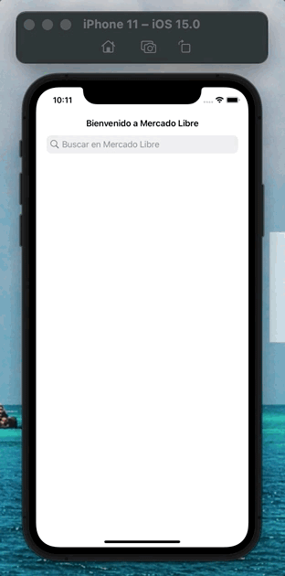
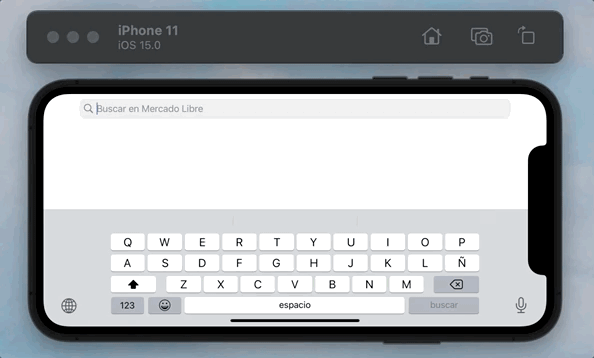
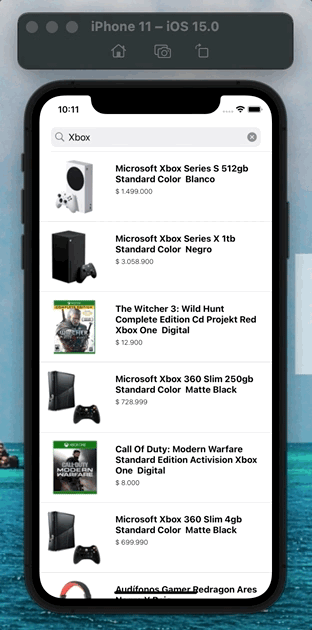
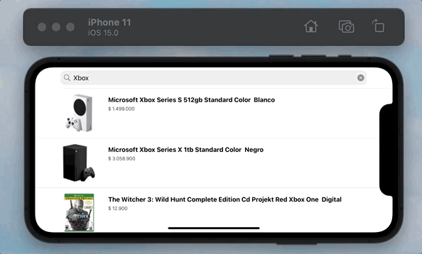
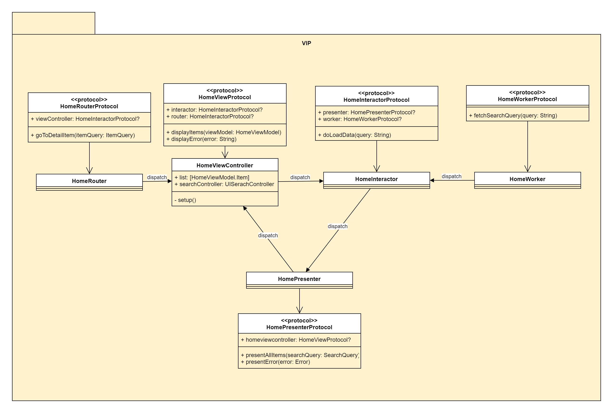
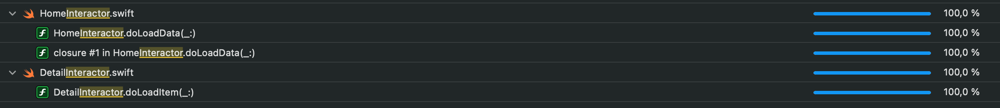
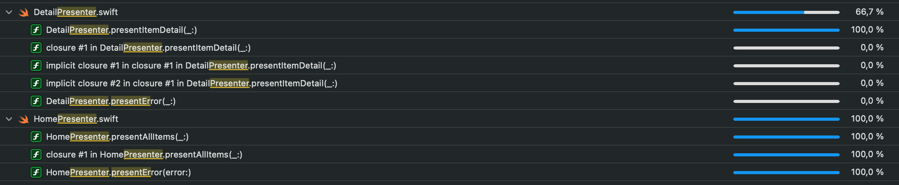
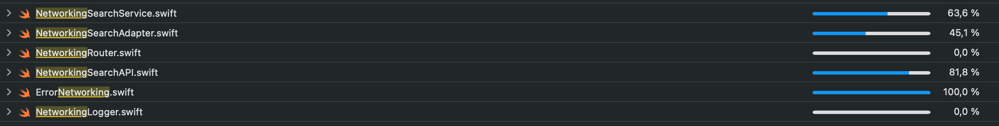

# Prueba Proceso de Seleccion Mercado Libre

*(Xcode Version 13.0, iOS 15)*

# Caracteristicas de la App

* **SearchPortrait**


* **SearchLandscape**


* **DetailPortrait**


* **DetailLandscape**


### HOME

En esta seccion se maneja la funcionalidad de busqueda al crear un UiSearchController como barra en la parte superior de la pantalla, tambien se muestra el resultado del llamado del servicio al presentar una lista de los productos y por ultimo al seleccionar uno de los items este presenta la pantalla de detalle

### DETAIL

# Arquitectura

* **DetailLandscape**


## VIEW
```swift
protocol HomeViewProtocol: AnyObject {
    var interactor: HomeInteractorProtocol? { get set }
    var router: HomeRouterProtocol? { get set }
    
    func displayItems(_ viewModel: HomeViewModel)
    func displayError(_ error: String)
}
```

## INTERACTOR
```swift
protocol HomeInteractorProtocol: AnyObject {
    var presenter: HomePresenterProtocol? { get set }
    var worker: HomeWorkerProtocol? { get set }
    
    func doLoadData(_ query: String)
}
```

## PRESENTER
```swift
protocol HomePresenterProtocol: AnyObject {
    var homeViewController: HomeViewProtocol? { get set }
    
    func presentAllItems(_ searchQUery: SearchQuery)
    func presentError(error: Error)
}
```

# Unit Test

### Coverage

* **Coverage Interactor**


* **Coverage Presenter**


* **Coverage Networking**
